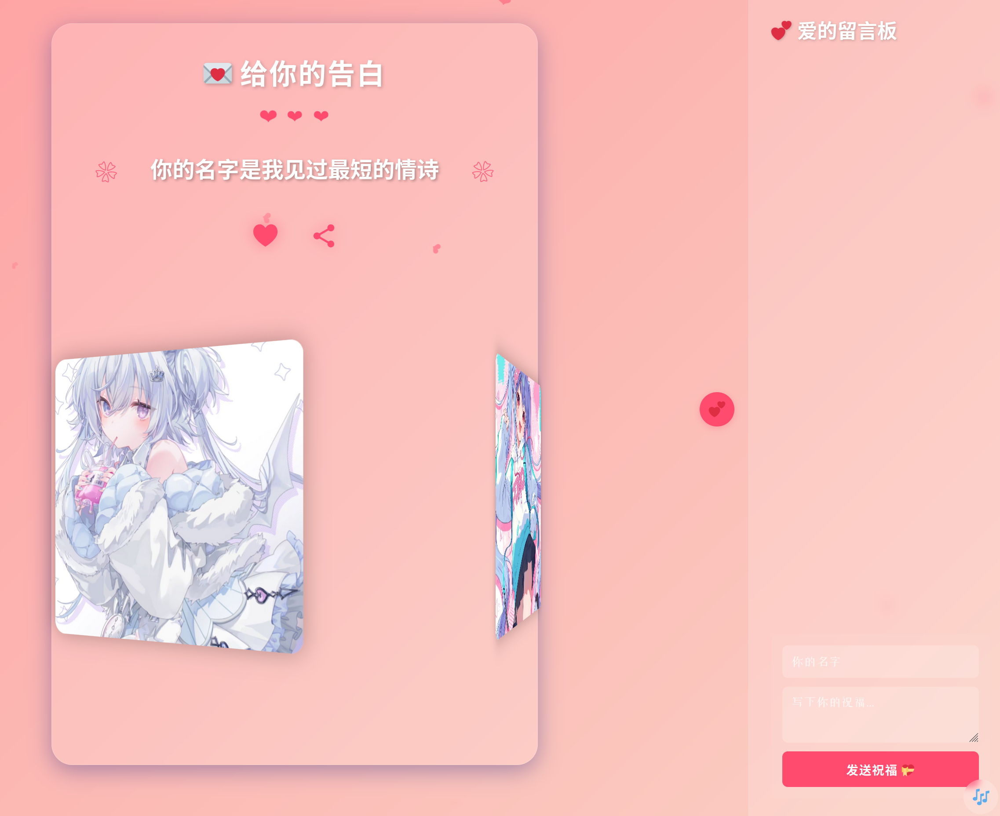

# 浪漫告白页面 💝

一个优雅的网页告白项目，通过精美的动画效果和温馨的情话，传达最真挚的感情。

[在线预览](http://www.baiyiqingxiang.online:520/) _(部署后添加链接)_

 _(可选：添加预览图)_

## ✨ 特色功能

- 🎯 **精选情话轮播**
  - 收录 20+ 条精选情话
  - 优雅的打字机展示效果
  - 一键刷新切换

- 🎨 **精美视觉设计**
  - 粉色渐变背景
  - 飘落的爱心动画
  - 3D 旋转相册
  - 毛玻璃特效

- 🎵 **沉浸式体验**
  - 浪漫背景音乐
  - 流畅的动画过渡
  - 响应式布局设计

- 💌 **互动留言板**
  - 优雅的侧边栏设计
  - 本地存储留言内容
  - 支持文字和表情输入

## 🚀 快速开始

1. **克隆项目**
   ```bash
   git clone https://github.com/你的用户名/项目名称.git
   cd 项目名称
   ```

2. **直接运行**
   - 双击打开 `index.html` 文件
   - 或者使用 Live Server 运行

3. **部署项目**
   - 支持部署到 GitHub Pages
   - 或其他任意静态网站托管平台

## 🛠️ 技术栈

- HTML5
- CSS3 
  - Flexbox
  - CSS Grid
  - CSS Animation
  - Media Queries
- JavaScript (ES6+)
  - Local Storage
  - Web Audio API
  - Share API

## 📁 项目结构

```
.
├── index.html          # 主页面
├── css/               
│   └── style.css      # 样式文件
├── js/                
│   └── main.js        # 主逻辑
├── assets/            
│   ├── images/        # 图片资源
│   └── music/         # 音乐文件
└── README.md          # 项目说明
```

## 🎯 使用说明

1. **情话展示**
   - 点击心形按钮随机切换情话
   - 支持自动打字机效果

2. **音乐控制**
   - 点击右下角音乐按钮控制背景音乐
   - 支持自动播放（需要用户授权）

3. **相册展示**
   - 3D 旋转展示照片
   - 支持鼠标悬停查看

4. **留言功能**
   - 点击右侧爱心按钮打开留言板
   - 支持名字和留言输入
   - 最多保存 50 条留言

## 📱 兼容性

- ✅ 移动端自适应
- ✅ 主流浏览器支持
  - Chrome (推荐)
  - Firefox
  - Safari
  - Edge

## 🔧 自定义配置

1. **修改情话内容**
   - 编辑 `js/main.js` 中的 `loveMessages` 数组

2. **更换背景音乐**
   - 替换 `assets/music/love.mp3` 文件

3. **更新相册照片**
   - 在 `assets/images/` 中替换照片
   - 修改 `index.html` 中的图片路径

## 📝 开发计划

- [ ] 添加更多动画效果
- [ ] 支持自定义主题色
- [ ] 添加更多交互功能
- [ ] 优化移动端体验

## 🤝 贡献指南

1. Fork 本项目
2. 创建新的功能分支
3. 提交你的更改
4. 发起 Pull Request

## 📄 开源协议

本项目基于 MIT 协议开源，详见 [LICENSE](LICENSE) 文件。

## 🙏 鸣谢

- 字体支持：[Google Fonts](https://fonts.google.com/)
- 图标来源：[Emoji](https://emojipedia.org/)

## 👨‍💻 作者

- 网站 - [http://www.baiyiqingxiang.online]
- GitHub - [@baiyiqingxiang0]
- Email - [baiyiqingxiang01@gmail.com]

---
如果这个项目帮助到你，欢迎给个 Star ⭐️ 